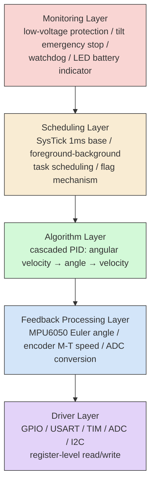

# STM32F103 Self-Balancing Robot

A two-wheeled self-balancing robot built from scratch on the STM32F103C8T6 using the Standard Peripheral Library, structured around a self-designed **5-layer "OLA" architecture** (Orthogonal Layering Architecture) combined with defensive programming principles.

Currently running a four-loop cascade PID + complementary filter; a future upgrade path to **LQR + Kalman filter** is planned (see Roadmap).

---

## Architecture: 5-Layer Tower

Every module in this project is placed into exactly one of five layers. Each layer talks only to its direct neighbor through an explicit interface (`.h` file) — it never reaches into a non-adjacent layer or touches another layer's internal state.

### Diagram 



*(Arrows show the requirement-derivation direction, top-down: the monitoring layer defines what's needed, each layer below implements it. Constraints and data flow the opposite direction, bottom-up.)*

### Core design principles

1. **Separation of concerns** — each layer does exactly one thing. The driver layer knows nothing about PID; the algorithm layer never touches a register.
2. **Requirements flow down, constraints flow up** — the monitoring layer defines *what's needed*, the driver layer reports back *what's possible* (e.g. SysTick was chosen as the scheduling time base specifically because it doesn't compete with TIM1/TIM2/TIM4, which are already claimed by motor PWM and the ADC trigger).
3. **Interfaces before implementation** — each layer's `.h` file is written first; internal state stays `static` inside the `.c` file.
4. **Program to interfaces, not internals** — `main.c` calls `Battery_GetFlag()`, never reads the raw ADC status register directly.

### Horizontal Axis: Interface Discipline

The 5-layer tower above is only the **vertical** axis of the architecture — it decides *which layer a module belongs to*. Orthogonal to it is a **horizontal** axis that decides *what a module's public interface looks like*, applied uniformly across every layer. This is where the name "Orthogonal Layering Architecture" (OLA) comes from.

Every module exposes only a fixed set of function types:

| Function type | Role | Analogy |
|---|---|---|
| `Init` | One-time setup: configure hardware / internal state | Constructor |
| `Set` | External write into the module (`VAR_INPUT`) | Feeding data in |
| `Update` | The module refreshes its own state periodically | The module's own "heartbeat" |
| `Get` | External read from the module (`VAR_OUTPUT`) | A read-only window out |
| `Reset` | Clears internal state | e.g. anti-windup reset on an integrator |

Paired with a fixed data-ownership rule:

- **`VAR`** — file-scope `static`, invisible outside the module
- **`VAR_INPUT`** — data written in through `Set`
- **`VAR_OUTPUT`** — data read out through `Get`

Because every module — no matter which of the 5 layers it lives in, or how different its internal logic is — exposes the same shape of interface, a caller never needs to learn a new access pattern per module. `Battery_GetVoltage()` and `Control_GetOmegaRef()` are used identically, and internal state is never reached into directly. In practice, once a module's interface (`Init`/`Set`/`Update`/`Get`/`Reset`) is nailed down in the `.h` file, the implementation in the `.c` file tends to follow naturally.

### Defensive programming

- Parameter validation at every function entry
- Error-reporting path depends only on the lowest layer, to avoid recursive stack overflow
- Flags are auto-cleared by the consumer on read, preventing duplicate handling
- Interface return values are cached in a local variable once per cycle, instead of being queried repeatedly

### Foreground/background scheduling model

|      | Foreground (interrupts)                                         | Background (main loop)                                     |
| ---- | --------------------------------------------------------------- | ---------------------------------------------------------- |
| What | `SysTick_Handler` (1ms tick), `ADC1_2_IRQHandler` (10ms sample) | Flag checks, threshold comparisons, periodic task dispatch |
| Rule | Keep it short — only capture data / raise a flag                | All business logic lives here                              |
### Analogy to CODESYS

Coming from an IEC 61131-3 / CODESYS background, this architecture maps almost one-to-one onto PLC concepts — which is part of why it felt natural to design it this way:

| CODESYS / IEC 61131-3 concept | This project |
|---|---|
| Cyclic **Task** (scan cycle) | `main()` while(1) loop, gated by tick-interval checks |
| **Event Task** (interrupt-driven) | `SysTick_Handler`, `ADC1_2_IRQHandler`, etc. |
| **GVL** (Global Variable List) | `static volatile` variables shared between an ISR and the main loop |
| **Function Block (FB)** encapsulation | Each `.c`/`.h` module pair — private `VAR` state, public `Init`/`Set`/`Get` interface |
| FB instance's private/internal variables | `static` variables inside a `.c` file, invisible outside the module |
| FB's `VAR_INPUT` / `VAR_OUTPUT` | This project's `Set*()` / `Get*()` interface functions |
| PLC's automatically managed scan cycle | Manually implemented here via the SysTick 1ms time base — there's no runtime "managing" it for you, so the scheduling layer has to do that bookkeeping by hand |
| Retentive/persistent variables (`VAR RETAIN`) | N/A in this project — no non-volatile state is currently persisted across resets |

The biggest practical difference: a PLC runtime guarantees the scan cycle's timing and re-entrancy for you. On bare-metal STM32, the scheduling layer has to *build* that guarantee itself — which is exactly why the foreground/background split (interrupts vs. main loop) and the flag-based handoff between them exist: they're a hand-rolled substitute for what a PLC scan cycle gives you for free.

---
## Engineering Highlights

A few implementation details worth calling out beyond the standard textbook approach:

**Improved T-method speed measurement.** 
Encoder speed is measured with a *modified* T-method rather than the pure T-method (single-interval timing) or pure M-method (pulse-counting over a fixed window) — combining interrupt-based edge-timing with the practical trade-offs both pure methods run into at low and high speed respectively.

**Microsecond-resolution time base built entirely on SysTick.** Rather than dedicating one of TIM1–TIM4 to timekeeping, the microsecond time base is derived purely from SysTick's own down-counter (`SysTick->VAL`) combined with the millisecond tick count — freeing all four general-purpose timers for motor PWM, ADC triggering, and encoder capture. Reading a microsecond timestamp correctly requires handling a race condition: if a SysTick overflow (ms tick increment) happens *between* reading the millisecond counter and reading `SysTick->VAL`, the two values become inconsistent. This is solved by disabling interrupts around the read and explicitly checking the `COUNTFLAG` bit — if it's set mid-read, the pending overflow is applied before combining the two values into a single microsecond-accurate result.

**A 4th PID loop, closed on the motor itself.** 
Beyond the three attitude/motion loops (velocity → angle → angular velocity), a 4th independent PID loop runs per-wheel, closing directly on motor speed. This loop is paired with a **PWM-level battery voltage compensation algorithm**: as the battery sags under load, the duty cycle is corrected in real time so that actual motor output stays consistent regardless of the momentary battery voltage — instead of motor response drifting as the battery drains over a run.

---

## Roadmap

- [ ] Migrate from complementary filter to a **Kalman filter** for attitude estimation
- [ ] Replace cascade PID with **LQR** state-feedback control
- [ ] FreeRTOS refactor: driver layer exposes `Init` + shared `Get` interfaces only (no dedicated task); feedback/filter runs as one task; each PID loop runs as an independent task, using overwrite-style data passing (length-1 queue / task notification) between them

---

## Hardware

- **MCU**: STM32F103C8T6
- **IMU**: MPU6050 (I2C)
- **Motor driver**: TB6612FNG
- **Encoders**: quadrature, interrupt-based edge-timing (modified  T-method) speed measurement
- **Battery sensing**: resistor-divider into ADC, PWM-level compensation for voltage sag

---

## Build

This project is built with **Keil MDK5**, using the STM32 Standard Peripheral Library (not HAL).

1. Open `Balance_Project.uvprojx` in Keil5
2. Build (F7)
3. Flash via ST-Link (SWD)

> Note: this repository does not use FreeRTOS yet (see Roadmap) — task scheduling is currently a hand-written foreground/background model driven by SysTick.

---

## Repository Structure

```
├── Control/     PID controllers, cascade arrangement (algorithm layer)
├── Data/        Complementary filter, encoder feedback processing
├── Hardware/    GPIO, ADC, motor PWM, encoder, I2C/MPU6050 drivers
├── Start/       Startup files, CMSIS core
├── User/        main.c, scheduling, task manager
├── Library/     ST Standard Peripheral Library
└── Balance_Project.uvprojx
```
