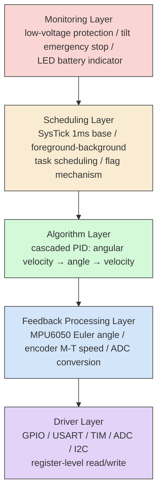

# STM32F103 Self-Balancing Robot
<p align="center">

</p>
A two-wheeled self-balancing robot built from scratch on the STM32F103C8T6 using the Standard Peripheral Library, structured around a self-designed **5-layer "OLA" architecture** (Orthogonal Layering Architecture) combined with defensive programming principles.

Currently running a four-loop cascade PID + complementary filter; a future upgrade path to **LQR + Kalman filter** is planned.

Based on the previous knowledge that was implemented in [STM32 Furuta inverted pendulum](https://github.com/Boren-Z/stm32-furuta-inverted-pendulum), and combining it with my Master's graduation project, a self-developed Orthogonal Layering Architecture for electromechanical systems is successfully applied.

---

## 5-Layer Architecture: 

For any electromechanical system, each module belongs to one of the following five layers. The Diagram below shows the distribution for this self-balancing vehicle project.

### Diagram 


```mermaid
graph TD
    A["Monitoring Layer<br/>low-voltage protection / tilt emergency stop /<br/> LED battery indicator"]
    B["Scheduling Layer<br/>SysTick 1ms base / foreground-background<br/>task scheduling / flag mechanism"]
    C["Algorithm Layer<br/>cascaded PID: angular velocity → angle → velocity"]
    D["Feedback Processing Layer<br/>MPU6050 Euler angle / encoder M-T speed / ADC conversion"]
    E["Driver Layer<br/>GPIO / USART / TIM / ADC / I2C<br/>register-level read/write"]

    A --> B --> C --> D --> E

    style A fill:#f9d5d3,stroke:#333
    style B fill:#f9ecd3,stroke:#333
    style C fill:#d3f9d8,stroke:#333
    style D fill:#d3e5f9,stroke:#333
    style E fill:#e3d3f9,stroke:#333
```

Arrows show the requirement-derivation direction, top-down: the monitoring layer defines what's needed; each layer below implements it. Constraints and data flow in the opposite direction, bottom-up. Data flows between layers via Set and Get interface functions.

### Core design principles

1. **Separation of functions**: each layer does exactly one thing. The driver layer knows nothing about PID; the algorithm layer never touches a register.
2. **Requirements flow down, constraints flow up**: the monitoring layer defines the need, while the driver layer reports the achievable goals back.
3. **Interfaces before implementation**: internal state stays `static` inside the `.c` file.
4. **Program to interfaces, not internals**: `main.c` calls `Battery_GetFlag()`, never reads the raw ADC status register directly.

### Horizontal Axis: Interface Discipline

The 5-layer above is the architecture's **vertical** axis; it determines which layer a module belongs to. Orthogonal to it is a **horizontal** axis that defines a module's public interface, applied uniformly across every layer. The name "Orthogonal Layering Architecture" (OLA) comes from the combination of the **vertical** axis idea and the **horizontal** axis one.

Every module exposes only a fixed set of function types:

| Function type | Role | Analogy |
|---|---|---|
| `Init` | configure hardware / internal state | Constructor |
| `Set` | External write into the module (`VAR_INPUT`) | Feeding data in |
| `Update` | The module refreshes its own state periodically | Module's iteration |
| `Get` | External read from the module (`VAR_OUTPUT`) | A read-only window out |
| `Reset` | Clears internal state | stop control when car fall down |

Inspired by CODESYS programming:

- **`VAR`**: file-scope `static`, invisible outside the module
- **`VAR_INPUT`**: data written in through `Set`
- **`VAR_OUTPUT`**: data read out through `Get`

Because every module exposes the same interface shape, the caller never needs to learn a new access pattern per module.

### Defensive programming

- Parameter validation at every function entry
- Flags are auto-cleared by the consumer on read, preventing duplicate handling

### Bare-metal multitasking model

|      | Foreground (interrupts)                                         | Background (main loop)                                     |
| ---- | --------------------------------------------------------------- | ---------------------------------------------------------- |
| What | `SysTick_Handler` (1ms tick), `ADC1_2_IRQHandler` (10ms sample) | Flag checks, threshold comparisons, periodic task dispatch |
| Rule | Keep it short — only capture data / raise a flag                | All business logic lives here                              |

### Analogy to CODESYS

Inspired by the IEC 61131-3 / CODESYS environment that, from my graduation project, this architecture maps almost one-to-one onto PLC counterparts:

| CODESYS / IEC 61131-3 concept | This project |
|---|---|
| **Scan Cycle**| `main()` while(1) loop, gated by tick-interval checks |
| **Event Task**  | `SysTick_Handler`, `ADC1_2_IRQHandler`, etc. |
| **GVL**  | `static volatile` variables shared between an ISR and the main loop |
| **Function Block (FB)** encapsulation | Each `.c`/`.h` module pair — private `VAR` state, public `Init`/`Set`/`Get` interface |
| FB instance's private/internal variables | `static` variables inside a `.c` file, invisible outside the module |
| FB's `VAR_INPUT` / `VAR_OUTPUT` | This project's `Set*()` / `Get*()` interface functions |
| PLC's automatically managed scan cycle | Manually implemented here via the SysTick 1ms time base |
| Retentive/persistent variables (`VAR RETAIN`) | No non-volatile state is currently persisted across resets |

The biggest practical difference: a PLC runtime guarantees scan-cycle timing and re-entrancy. On bare-metal STM32, the scheduling layer has to *build* that guarantee itself, which is exactly why the foreground/background need to be separated, and the flag-based handoff between them exists as a substitute for what a PLC scan cycle provides.

---
## Engineering Highlights

A few implementation details worth calling:

**Improved T-method speed measurement.** 
Encoder speed is measured with a *modified* T-method rather than the pure T-method (single-interval timing) or pure M-method (pulse-counting over a fixed window). In this project, the speed measurement combines interrupt-based edge-timing with the practical trade-offs both pure methods run into at low and high speed.

**Microsecond-resolution time base built entirely on SysTick.** Rather than implementing one of TIM1–TIM4 for the system time base, the microsecond time base is derived purely from SysTick's own down-counter (`SysTick->VAL`) combined with the millisecond tick count.

**A 4th PID loop, closed on the motor itself.** 
Beyond the three motion loops (velocity → angle → angular velocity), a 4th independent PID loop runs per-wheel (inspired by CODESYS; treat VAR_IN_OUT as a specific control instance), closing directly on motor speed. Paired with a **PWM battery voltage compensation algorithm**: when the battery sags under load, the duty cycle is corrected in real time so actual motor output stays consistent — avoiding motors' response drifting as the battery drains over a run.

---

## Roadmap

- [ ] Migrate from complementary filter to a **Kalman filter** for attitude estimation
- [ ] Replace cascade PID with **LQR** state-feedback control

---

## Hardware

- **MCU**: STM32F103C8T6
- **IMU**: MPU6050 (I2C)
- **Motor driver**: TB6612FNG
- **Encoders**: quadrature, interrupt-based edge-timing (modified  T-method) speed measurement
- **Battery sensing**: resistor-divider into ADC, PWM-level compensation for voltage sag

---

## Build

This project is built in **Keil MDK5** using the STM32 Standard Peripheral Library (not HAL).

1. Open `Balance_Project.uvprojx` in Keil5
2. Build (F7)
3. Flash via ST-Link (SWD)

---

## Repository Structure

```
├── Control/     PID controllers, cascade arrangement (algorithm layer)
├── Data/        Complementary filter, encoder feedback processing
├── Hardware/    GPIO, ADC, motor PWM, encoder, I2C/MPU6050 drivers
├── Start/       Startup files, CMSIS core
├── User/        main.c, scheduling, task manager
├── Library/     ST Standard Peripheral Library
└── Balance_Project.uvprojx
```
